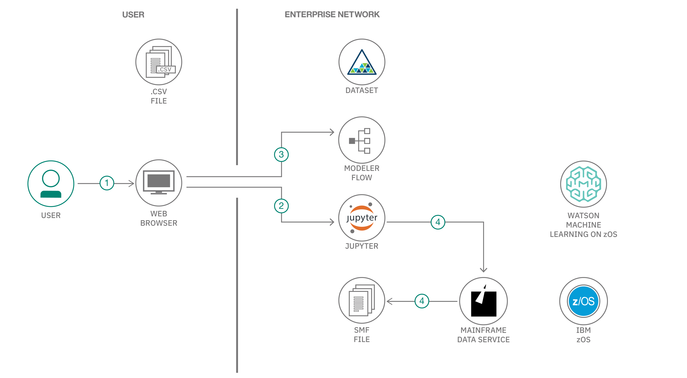

# Short title
 
Analyze batch job on mainframe with machine learning

# Long title

Analyze batch job on IBM mainframe via Watson Machine Learning on zOS

# Author

* ZHUO Ling <zhuoling@cn.ibm.com>

# URLs

### Github repo

* https://github.ibm.com/IBM/analyze-batch-job-z

# Summary

The pattern demonstrate how to analyze batch job on mainframe with Watson Machine Learning on zOS. Including to ingest batch job run time data from SMF Type 30 log, explore periodicity and correlation, predict elapsed time and detect anomaly.

# Technologies

* Analytics
* Machine Learning on zOS

# Description

Running batch job is critical operation on mainframe. Everyday there are 10000~60000 jobs running at day and night. During begin or end day of month/quarter/year, the workload may reach twice of regular days. It is demanded to operate mainframe in a optimal status with high productive and sufficient to business demand.

Machine learning analytics on large volume logs of batch job could help administrators in 4 aspects:

* Understand batch job seasonality and workload change trend
* Gain insight of important impact for batch job elapsed time
* Predict elapsed time of long time batch jobs
* Identify candidate of abnormal batch job instances

# Flow

<!--add an image in this path-->

1. You could work on WMLz(IBM Watson Machine Learning for zOS) through web browser.
2. WMLz provides Jupyter Notebook for you to code in Python, SCALA and R.
3. WMLz provides Modeler Flow for you to explore data and train model in canvas by drop and down.
4. You could read z native file such as SMF Type 30 file with Python notebook based on mainframe data service included in WMLz.

# Instructions

1. Download .zip (for Windows or Mac) or .tar.gz (for Linux) file in folder of "ProjectZIP" to your computer
2. Login to WMLz in your enterprise WMLz URL, with your username and password.
3. Select "Projects" in left menu pellete, click on "Create New Project"
4. Select tab of "Add from file", browse in your computer and select the file you downloaded in step 1, click "OK"
5. Check the added new project, it should includes 4 notebooks,2 flows and 5 datasets.

# Components and services

* IBM Watson Machine Learning on zOS server
* IBM Mainframe Data Service on zOS server

# Runtimes

* Web Browser
* python

# Related IBM Developer content

# Related links
<a href="https://www.ibm.com/us-en/marketplace/machine-learning-for-zos">IBM Watson Machine Learning for z/OS </a>

<a href="http://www.redbooks.ibm.com/abstracts/sg248421.html?Open">Turning Data into Insight with IBM Machine Learning for z/OS </a>

<a href="https://www.ibm.com/support/knowledgecenter/zosbasics/com.ibm.zos.zmainframe/zconc_batchproc.htm">Mainframes working after hours: Batch processing </a>

<a href="https://en.wikipedia.org/wiki/IBM_System_Management_Facilities">IBM System Management Facilities </a>

<a href="https://www.ibm.com/support/knowledgecenter/en/SSLTBW_2.3.0/com.ibm.zos.v2r3.ieag200/rec30.htm">IBM SMF Type 30 record </a>

There are several real client use cases on mainframe batch job analytics, you are welcome to email to author(zhuoling@cn.ibm.com) for further discussion. 
